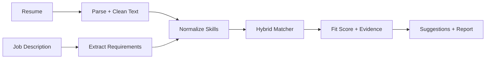

# TalentFit Engine

**TalentFit Engine** is an explainable resume-to-job matching system that parses a resume and job description, extracts structured skills, computes a fit score, and shows evidence-based strengths, gaps, and resume improvement suggestions.

---

## What It Does

Users can:

- Upload or paste a resume
- Paste a job description
- Extract candidate skills and job requirements
- Normalize skill synonyms such as `sklearn` → `scikit-learn` and `Postgres` → `PostgreSQL`
- Compute a candidate-job fit score
- View matched skills, missing skills, partial matches, risk flags, and evidence snippets
- Get resume improvement suggestions grounded only in the uploaded resume

---

## Tech Stack

- Python
- FastAPI
- Streamlit
- Pydantic
- PyMuPDF / python-docx
- sentence-transformers
- scikit-learn
- pandas / NumPy
- pytest
- Docker

---

## How It Works

## Personal Use Case

I am using this actively in my job search to compare my resume against job descriptions and identify skill gaps.

The public version runs locally without paid API keys. For my own workflow, I also test an optional LLM-assisted extraction layer using **Gemini 2.5 Flash**, while keeping the scoring and explanations evidence-based and interpretable.