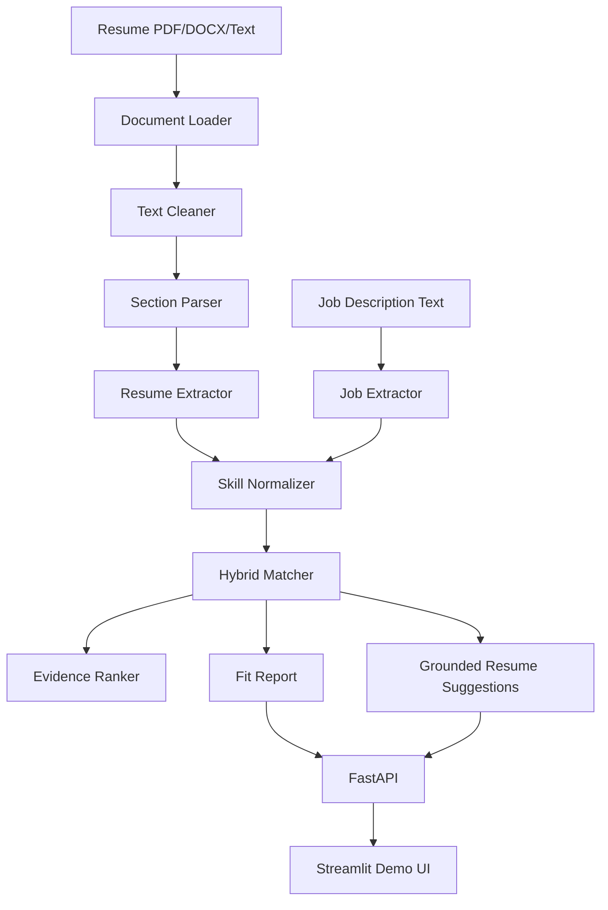

# TalentFit Engine — Explainable Resume-to-Job Matching System

**TalentFit Engine** is a portfolio-ready ML/AI engineering project that parses resumes and job descriptions, normalizes skills, computes an explainable candidate-job fit score, and returns evidence-grounded improvement suggestions.

> This is not a generic resume parser. TalentFit Engine demonstrates production-style AI engineering patterns: structured extraction, skill normalization, hybrid retrieval/scoring, explainable ranking, grounded suggestions, evaluation, and API deployment.

## What this project is — and is not

This project is intentionally built as a **local-first MVP**. The core system does not require OpenAI, Claude, Gemini, or any paid API key.

It uses deterministic extraction, a skill taxonomy, TF-IDF, and local sentence-transformer embeddings when available. That makes the output easier to debug and defend in an interview. It is **not** a hiring decision system, not a calibrated probability of job success, and not a replacement for recruiter review.

## Why it matters

Resume matching is a strong ML engineering use case because it combines several real production concerns:

- messy unstructured documents
- ambiguous skill names and synonyms
- ranking/scoring design
- explainability and evidence grounding
- API design and UI integration
- evaluation beyond a single demo example

The goal is to show how an ML engineer can design a practical AI system that is transparent, testable, and deployable.

## Architecture



## Core features

- Parse resumes from PDF, DOCX, or plain text.
- Detect common resume sections: summary, skills, experience, education, projects, and certifications.
- Extract job profile fields: title, required skills, preferred skills, responsibilities, years of experience, seniority, and keywords.
- Normalize skill aliases such as:
  - `Postgres` → `PostgreSQL`
  - `sklearn` → `scikit-learn`
  - `gen ai` → `Generative AI`
  - `vector db` → `Vector Database`
  - `PowerBI` → `Power BI`
- Score fit using a hybrid, decomposable ranker.
- Return matched skills, missing required skills, missing preferred skills, partial matches, risk flags, and evidence snippets.
- Generate resume suggestions grounded only in the uploaded resume text.
- Provide both a FastAPI API and a Streamlit demo UI.
- Include tests and small evaluation scripts.

## Tech stack

- Python 3.11+
- FastAPI
- Streamlit
- Pydantic
- PyMuPDF
- python-docx
- sentence-transformers
- scikit-learn
- pandas / NumPy
- pytest
- Docker / docker-compose

## Setup

```bash
cd talentfit-engine
python -m venv .venv
source .venv/bin/activate  # Windows PowerShell: .venv\Scripts\Activate.ps1
pip install -r requirements.txt
```

Run the API:

```bash
uvicorn app.main:app --reload
```

Run the UI in another terminal:

```bash
streamlit run ui/streamlit_app.py
```

Run with Docker:

```bash
docker-compose up --build
```

## API examples

Health check:

```bash
curl http://localhost:8000/health
```

Parse a job description:

```bash
curl -X POST http://localhost:8000/parse/job \
  -H "Content-Type: application/json" \
  -d '{"job_description":"Required: Python, FastAPI, NLP, Docker. Preferred: Kubernetes."}'
```

Analyze pasted resume text:

```bash
curl -X POST http://localhost:8000/analyze \
  -F "resume_text=$(cat app/data/sample_resume.txt)" \
  -F "job_description=$(cat app/data/sample_job_description.txt)"
```

Analyze an uploaded resume file:

```bash
curl -X POST http://localhost:8000/analyze \
  -F "file=@resume.pdf" \
  -F "job_description=$(cat app/data/sample_job_description.txt)"
```

## Scoring methodology

The score is a weighted heuristic, not a trained prediction model. It is designed to be explainable and easy to modify.

| Component | Weight | What it means |
|---|---:|---|
| Required skill coverage | 35% | Share of normalized required skills found in the resume |
| Preferred skill coverage | 15% | Share of normalized preferred skills found in the resume |
| Semantic similarity | 20% | Local sentence-transformer similarity; falls back to TF-IDF if the model cannot load |
| Keyword similarity | 15% | TF-IDF cosine similarity between resume and job description |
| Experience alignment | 10% | Simple comparison of explicit years mentioned in resume vs job |
| Project relevance | 5% | TF-IDF similarity between project text and the job description |

The weights live in `app/core/matcher.py`.

### Why this is defensible

The system exposes the score breakdown instead of hiding behind a black-box number. In an interview, I would explain that these weights are product assumptions. In production, I would tune them using recruiter feedback, interview outcomes, or a labeled candidate-job relevance dataset.

## Evaluation methodology

The `evals/` folder contains a small, transparent evaluation harness:

- `eval_extraction.py` measures skill extraction precision, recall, and F1 against labeled expected skills.
- `eval_matching.py` checks whether strong, medium, and weak examples fall into reasonable score ranges and reports latency.
- `labeled_examples.json` contains a few sample cases used for regression testing and methodology demonstration.

Run:

```bash
python -m evals.eval_extraction
python -m evals.eval_matching
```

This is intentionally described as a **smoke evaluation**, not a benchmark. A stronger evaluation would require more resumes, more job families, independent labels, and calibration against recruiter decisions.

## Tests

```bash
pytest
```

Tests cover:

- synonym normalization
- skill extraction
- alias-backed evidence extraction
- explicit years-of-experience extraction
- matching score output range
- missing required skill detection
- evidence snippet generation
- API health endpoint

## Project structure

```text
talentfit-engine/
  README.md
  requirements.txt
  .env.example
  .gitignore
  Dockerfile
  docker-compose.yml
  app/
    main.py
    config.py
    api/routes.py
    core/
      document_loader.py
      text_cleaner.py
      section_parser.py
      skill_normalizer.py
      resume_extractor.py
      job_extractor.py
      matcher.py
      explainer.py
      suggestions.py
    schemas/
      resume.py
      job.py
      match.py
    data/
      skills_taxonomy.json
      sample_resume.txt
      sample_job_description.txt
  ui/streamlit_app.py
  evals/
    eval_extraction.py
    eval_matching.py
    labeled_examples.json
  tests/
```

## Demo screenshots

Add screenshots after running the Streamlit app:

```text
docs/screenshots/upload_resume.png
docs/screenshots/match_score.png
docs/screenshots/fit_report.png
```

## Design choices and tradeoffs

### 1. Taxonomy-based skill extraction instead of pure LLM extraction

This makes the MVP deterministic, local, and easy to test. The tradeoff is that unknown skills are missed until the taxonomy is updated.

### 2. Hybrid ranker instead of a black-box classifier

A hybrid score is easier to explain and debug. The tradeoff is that the weights are manually chosen and not calibrated from outcomes.

### 3. Evidence snippets are constrained to resume text

This reduces hallucinated feedback. The tradeoff is that suggestions can be conservative when the resume implies a skill indirectly but does not say it clearly.

### 4. Heuristic job parsing

The system can separate required and preferred skills when the JD uses clear wording. It can misclassify skills in messy postings, especially when requirements and preferences are mixed in one paragraph.

### 5. Local embeddings

Local sentence-transformers avoid paid APIs and protect privacy. The tradeoff is a heavier install and a first-run model download.

## Limitations

- The parser is not layout-aware; complex PDF formatting can still hurt extraction quality.
- The skill taxonomy is broad but not exhaustive.
- Required vs preferred classification is heuristic.
- Years-of-experience extraction only uses explicit phrases like `3+ years`; it does not infer from employment date ranges.
- Partial matches are weak signals based on shared skill category, not proof of equivalent experience.
- The score is not calibrated and should not be used as an automated hiring decision.
- The current evaluation examples demonstrate methodology but are too small to claim production-grade accuracy.

## Future work

- Add optional LLM structured extraction behind `USE_OPTIONAL_LLM=true`, with strict JSON schemas and validation.
- Add layout-aware resume parsing for complex PDFs.
- Add pgvector or another vector database for persistent candidate/job search.
- Add cross-encoder reranking for more accurate semantic matching.
- Add section-aware and recency-aware scoring.
- Add confidence scores for extracted skills and requirements.
- Build a larger labeled evaluation set across ML, analytics, backend, and data engineering roles.
- Add CI with linting, tests, Docker build, and evaluation checks.
- Add a multi-candidate recruiter view.
- Add human feedback loops to tune weights and improve taxonomy coverage.

## Resume bullets

Use these only after you can explain the implementation and tradeoffs clearly:

- Built **TalentFit Engine**, an explainable resume-to-job matching system with FastAPI, Streamlit, Pydantic schemas, PDF/DOCX parsing, and Dockerized local deployment.
- Implemented taxonomy-based skill normalization for 80+ technical skills, resolving aliases such as `Postgres`, `sklearn`, `PowerBI`, `gen ai`, and `vector db` into canonical skill labels.
- Designed a hybrid fit-scoring engine combining required/preferred skill coverage, sentence-transformer semantic similarity, TF-IDF similarity, explicit experience alignment, and project relevance into an auditable 0–100 score.
- Built grounded explainability features including matched/missing skills, weak partial matches, risk flags, and resume evidence snippets used to generate job-specific improvement suggestions without fabricating claims.
- Added a lightweight evaluation harness for extraction precision/recall/F1, matching sanity checks, and latency tracking, plus pytest coverage for normalization, matching, evidence extraction, and API health.

## Interview talking points

- **Why not only use an LLM?** The MVP is local-first and deterministic. I wanted a system that is testable, privacy-friendly, and explainable before adding optional LLM extraction.
- **How does the score work?** It is a hybrid heuristic. Required skill coverage has the highest weight, while semantic and TF-IDF similarity capture broader text alignment. The score breakdown is returned so users can audit it.
- **How do you prevent hallucinated suggestions?** Suggestions must include evidence from the resume text. Missing-skill suggestions tell the user to add the skill only if truthful or to build evidence first.
- **What is the biggest weakness?** The taxonomy and heuristic parser limit recall. A production system needs broader labeled data, better parsing, calibration, and human feedback.
- **How would you productionize it?** I would add CI, logging, monitoring, persistent storage, a vector index, async processing for large files, model/version tracking, and a larger evaluation set.
- **How would you evaluate it better?** I would collect labeled candidate-job pairs, evaluate extraction and ranking separately, measure top-k relevance, compare against recruiter judgments, and calibrate score thresholds by role family.
