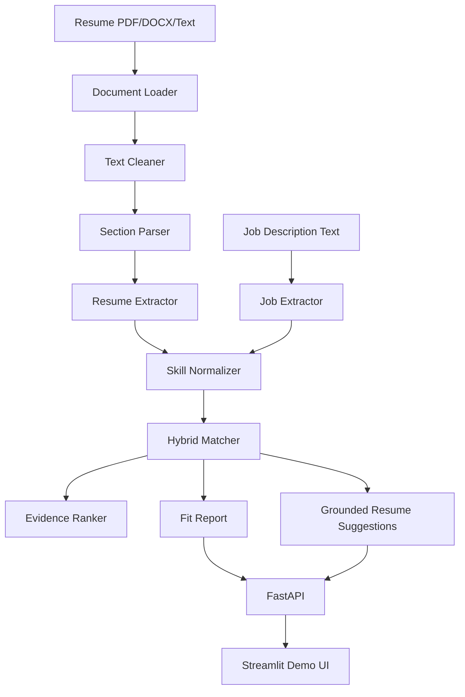

# TalentFit Engine — Explainable Resume-to-Job Matching System

**TalentFit Engine** is a portfolio-ready ML/AI engineering project that parses resumes and job descriptions, normalizes skills, computes an explainable candidate-job fit score, and returns evidence-grounded improvement suggestions.

> This is not a generic resume parser. TalentFit Engine demonstrates production-style AI engineering patterns: structured extraction, skill normalization, hybrid retrieval/scoring, explainable ranking, grounded suggestions, evaluation, and API deployment.

## What this project is — and is not

This project is intentionally built as a **local-first MVP**. The core system does not require OpenAI, Claude, Gemini, or any paid API key.


## Why it matters

Resume matching is a strong ML engineering use case because it combines several real production concerns:

- messy unstructured documents
- ambiguous skill names and synonyms
- ranking/scoring design
- explainability and evidence grounding
- API design and UI integration
- evaluation beyond a single demo example

## Architecture



## Core features

- Parse resumes from PDF, DOCX, or plain text.
- Detect common resume sections: summary, skills, experience, education, projects, and certifications.
- Extract job profile fields: title, required skills, preferred skills, responsibilities, years of experience, seniority, and keywords.
- Normalize skill aliases such as:
  - `Postgres` → `PostgreSQL`
  - `sklearn` → `scikit-learn`
  - `gen ai` → `Generative AI`
  - `vector db` → `Vector Database`
  - `PowerBI` → `Power BI`
- Score fit using a hybrid, decomposable ranker.
- Return matched skills, missing required skills, missing preferred skills, partial matches, risk flags, and evidence snippets.
- Generate resume suggestions grounded only in the uploaded resume text.
- Provide both a FastAPI API and a Streamlit demo UI.
- Include tests and small evaluation scripts.

## Tech stack

- Python 3.11+
- FastAPI
- Streamlit
- Pydantic
- PyMuPDF
- python-docx
- sentence-transformers
- scikit-learn
- pandas / NumPy
- pytest
- Docker / docker-compose

## Setup

```bash
cd talentfit-engine
python -m venv .venv
source .venv/bin/activate  # Windows PowerShell: .venv\Scripts\Activate.ps1
pip install -r requirements.txt
```

Run the API:

```bash
uvicorn app.main:app --reload
```

Run the UI in another terminal:

```bash
streamlit run ui/streamlit_app.py
```

Run with Docker:

```bash
docker-compose up --build
```

## API examples

Health check:

```bash
curl http://localhost:8000/health
```

Parse a job description:

```bash
curl -X POST http://localhost:8000/parse/job \
  -H "Content-Type: application/json" \
  -d '{"job_description":"Required: Python, FastAPI, NLP, Docker. Preferred: Kubernetes."}'
```

Analyze pasted resume text:

```bash
curl -X POST http://localhost:8000/analyze \
  -F "resume_text=$(cat app/data/sample_resume.txt)" \
  -F "job_description=$(cat app/data/sample_job_description.txt)"
```

Analyze an uploaded resume file:

```bash
curl -X POST http://localhost:8000/analyze \
  -F "file=@resume.pdf" \
  -F "job_description=$(cat app/data/sample_job_description.txt)"
```

## Scoring methodology

The score is a weighted heuristic, not a trained prediction model. It is designed to be explainable and easy to modify.

| Component | Weight | What it means |
|---|---:|---|
| Required skill coverage | 35% | Share of normalized required skills found in the resume |
| Preferred skill coverage | 15% | Share of normalized preferred skills found in the resume |
| Semantic similarity | 20% | Local sentence-transformer similarity; falls back to TF-IDF if the model cannot load |
| Keyword similarity | 15% | TF-IDF cosine similarity between resume and job description |
| Experience alignment | 10% | Simple comparison of explicit years mentioned in resume vs job |
| Project relevance | 5% | TF-IDF similarity between project text and the job description |

The weights live in `app/core/matcher.py`.


## Evaluation methodology

The `evals/` folder contains a small, transparent evaluation harness:

- `eval_extraction.py` measures skill extraction precision, recall, and F1 against labeled expected skills.
- `eval_matching.py` checks whether strong, medium, and weak examples fall into reasonable score ranges and reports latency.
- `labeled_examples.json` contains a few sample cases used for regression testing and methodology demonstration.

Run:

```bash
python -m evals.eval_extraction
python -m evals.eval_matching
```


## Tests

```bash
pytest
```

Tests cover:

- synonym normalization
- skill extraction
- alias-backed evidence extraction
- explicit years-of-experience extraction
- matching score output range
- missing required skill detection
- evidence snippet generation
- API health endpoint

## Project structure

```text
talentfit-engine/
  README.md
  requirements.txt
  .env.example
  .gitignore
  Dockerfile
  docker-compose.yml
  app/
    main.py
    config.py
    api/routes.py
    core/
      document_loader.py
      text_cleaner.py
      section_parser.py
      skill_normalizer.py
      resume_extractor.py
      job_extractor.py
      matcher.py
      explainer.py
      suggestions.py
    schemas/
      resume.py
      job.py
      match.py
    data/
      skills_taxonomy.json
      sample_resume.txt
      sample_job_description.txt
  ui/streamlit_app.py
  evals/
    eval_extraction.py
    eval_matching.py
    labeled_examples.json
  tests/
```

## Limitations

- The parser is not layout-aware; complex PDF formatting can still hurt extraction quality.
- The skill taxonomy is broad but not exhaustive.
- Required vs preferred classification is heuristic.
- Years-of-experience extraction only uses explicit phrases like `3+ years`; it does not infer from employment date ranges.
- Partial matches are weak signals based on shared skill category, not proof of equivalent experience.
- The score is not calibrated and should not be used as an automated hiring decision.
- The current evaluation examples demonstrate methodology but are too small to claim production-grade accuracy.

## Future work

- Extending to this we can use LLM structured extraction behind `USE_OPTIONAL_LLM=true`, with strict JSON schemas and validation.


